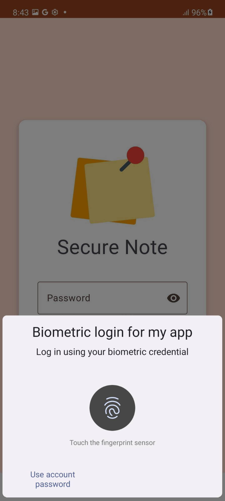
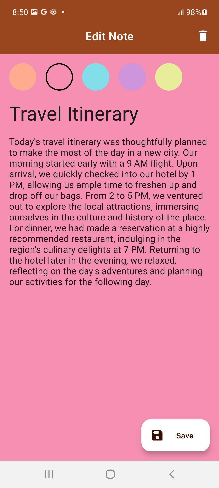
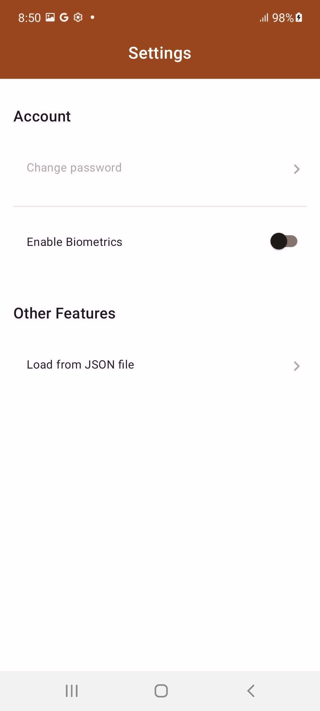

#  Secure Note

This is an secure note taking demo android application

## Installation
Clone this repository and import into **Android Studio**
```bash
git clone https://github.com/alvarosct02/securenote.git
```

## How to use the app

### Note Management
1. Open the app & enter **any longer than 4 characters password**
2. Add new notes
3. Edit or Delete them

### Enabling Biometrics
1. Go to settings (top bar icon)
2. Tap on Enable biometrics
3. From now on each time you open the app a biometrics modal will pop up
   
Note: This option will only appear if you have biometrics setup on your device.

### Load Notes with a Json  file
1. Go to settings (top bar icon)
2. Tap on 'Load from Json file'
3. Select a **valid** json file (like this one: <a target="_blank" href="assets/notesSample.json" download="notesSample.json">notesSample.json</a>)

Note: The json file must follow this format:
```Json
[
	{
		"title": "Some title", 
		"messsage": "Some note" 
	}
]
```
   
Note: This option will only appear if you have biometrics setup on your device.


## Tech Stack:

- Kotlin
- MVVM
- Hilt
- Coroutines
- Flow
- ViewModel
- Room
- Navigation Component
- Databinding

## Core Features:

| Biometrics Login | List Notes | Edit Notes |
| --- | --- | --- |
|  |  |  |

## Other implemented features:

- Loading JSON files (<a target="_blank" href="assets/notesSample.json" download="notesSample.json">Download Json File to test</a>)
- Toogle biometrics
- Encrypted Database

| Settings Page | Import Json | Light/Night Theme |
| --- | --- | --- |
|  |  |  |


## Maintainers
This project is mantained by:
* [Alvaro Santa Cruz](http://github.com/alvarosct02)

## Contributing

1. Fork it
2. Create your feature branch (git checkout -b my-new-feature)
3. Commit your changes (git commit -m 'Add some feature')
4. Push your branch (git push origin my-new-feature)
5. Create a new Pull Request
